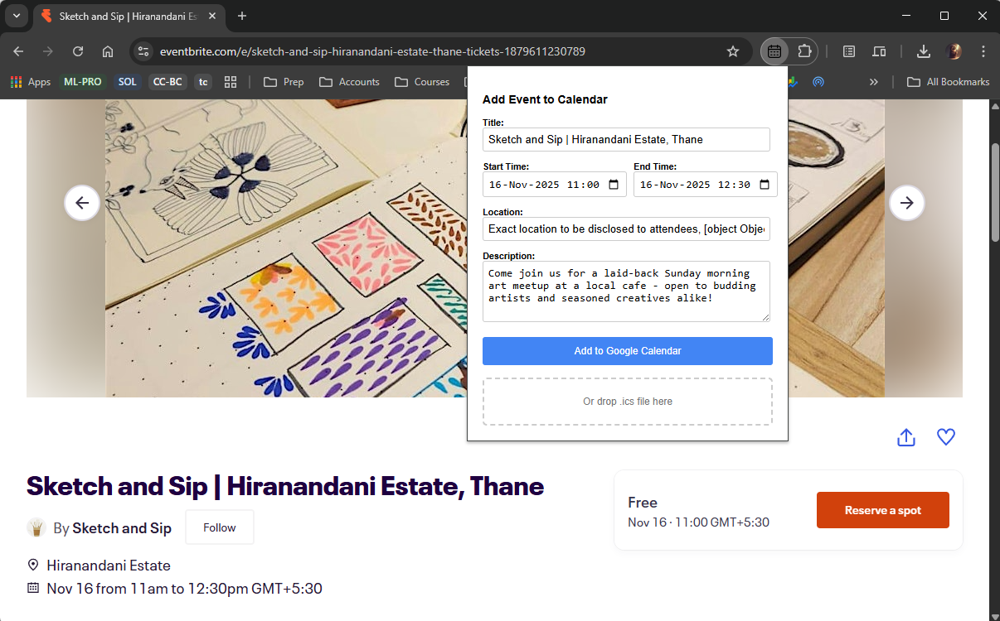

# Quick Add to Calendar

A simple but powerful browser extension that identifies event details on a webpage and allows you to quickly add them to your Google Calendar. It also includes a robust fallback for parsing `.ics` calendar files.

<!--  -->

<div style="text-align: center;">
  
</div>

---

## Features

-   **Automatic Event Detection:** Intelligently scans webpages for event information using:
    -   **Structured Data (JSON-LD):** The most reliable method, used by sites like Eventbrite and Meetup.
    -   **Heuristics:** Falls back to analyzing page titles, headings, and meta tags if no structured data is found.
-   **Full Event Details:** Parses not just the title and start time, but also the end time, location, and description.
-   **ICS File Parsing:** A powerful fallback for complex sites. If a page offers a "Download Calendar" or `.ics` link, you can simply drop the file onto the extension's popup to populate all fields perfectly.
-   **Direct Google Calendar Integration:** Uses Google's official API and OAuth 2.0 to securely add events directly to the user's primary calendar with a single click.
-   **Simple & Clean UI:** The popup provides a clear, editable form pre-filled with the discovered event details, allowing for quick review before adding.

---

## Tech Stack

-   **Core:** HTML, CSS, JavaScript (ES6+)
-   **Browser APIs:** WebExtensions API (Manifest V3)
-   **Google Services:** Google Calendar API, Google Identity (OAuth 2.0)
-   **Libraries:** `ical.js` for parsing `.ics` files.

---

## Setup for Development

Follow these steps to load and test the extension locally.

### 1. Prerequisites

-   Google Chrome (or a Chromium-based browser like Edge or Brave).
-   A Google Cloud Platform project with the Google Calendar API enabled.

### 2. Configuration

1.  **Clone the repository:**
    ```bash
    git clone https://github.com/lokiT26-Utilities/quick-add-to-calendar.git
    cd quick-add-to-calendar
    ```

2.  **Create Google API Credentials:**
    -   Go to the [Google Cloud Console](https://console.cloud.google.com/).
    -   Create a new project.
    -   Enable the **Google Calendar API**.
    -   Go to "Credentials" -> "Create Credentials" -> "OAuth client ID".
    -   Select **Chrome App** as the application type.
    -   You will need the extension's ID to complete this step. You can get it after loading the extension (see step 3.4 below). Once you have it, paste it into the "Application ID" field in the Cloud Console.
    -   This will generate a **Client ID**.

3.  **Update the Manifest:**
    -   Open the `manifest.json` file.
    -   Find the `oauth2` key and replace `"YOUR_CLIENT_ID_GOES_HERE.apps.googleusercontent.com"` with your actual Client ID from the step above.

### 3. Loading the Extension

1.  Open Chrome and navigate to `chrome://extensions`.
2.  Enable **"Developer mode"** in the top-right corner.
3.  Click the **"Load unpacked"** button.
4.  Select the `quick-add-to-calendar` project folder. The extension should now appear in your toolbar.
5.  *Note:* If this is the first time loading, Chrome will assign a unique ID to your extension. Copy this ID and use it to complete step 2.2 above.

### 4. Setting up Test Users

For development, your Google Cloud project will be in "Testing" mode. You must add your Google account as an authorized test user.

-   In the Google Cloud Console, go to **APIs & Services -> OAuth consent screen**.
-   Under "Test users", click **"+ ADD USERS"** and enter the email address of the Google account you'll be using to test the extension.

---

## How to Use

1.  Navigate to a webpage containing an event (e.g., an Eventbrite page).
2.  Click the extension icon in your browser's toolbar.
3.  The popup will appear, pre-filled with the event details it found.
4.  **Alternatively:** If the page has a `.ics` file download link, download the file and drag it onto the "drop zone" in the popup.
5.  Review and edit the details as needed.
6.  Click the **"Add to Google Calendar"** button.
7.  The first time you use it, you will be prompted to sign in to your Google account and grant permission.
8.  The event will be added to your primary Google Calendar!